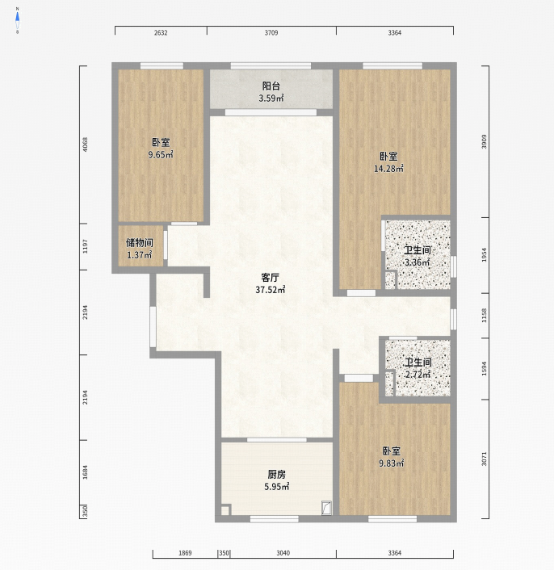

<div align="center">

# Roomify

**Floor plans in. Measured JSON out.**

Roomify parses residential floor-plan images and PDFs into rooms, walls,
openings, and millimetre-scale geometry.

[English](README.md) · [简体中文](README_ZH.md)


</div>

OpenCV measures the geometry. A vision-language model reads labels and
symbols. The model never supplies coordinates. Without a VLM, Roomify still
returns pixel geometry and records what it could not resolve.

```bash
roomify floorplan.png -o floorplan.json
```

## Example

This plan is included in the repository:

<p align="center">
  
</p>

[`floorplan-1.png`](examples/floorplan-1.png) →
[`floorplan-1.json`](examples/floorplan-1.json)

Roomify found:

- 9 rooms
- 55 wall segments
- 18 wall openings
- separate horizontal and vertical scales, with `high` confidence
- a living-room area of 37.34 m²; the drawing prints 37.52 m²

Selected fields from the full output:

```json
{
  "schema_version": "1.0",
  "scale": {
    "px_per_mm_x": 0.0431736218444101,
    "px_per_mm_y": 0.048002053563788824,
    "method": "dimension_chains+printed_areas",
    "confidence": "high"
  },
  "rooms": [
    {
      "id": "room_1",
      "name": "客厅",
      "room_type": "living_room",
      "area_sqm": 37.33987625081361,
      "printed_area_sqm": 37.52,
      "area_deviation_flag": false,
      "source": "cv+vlm",
      "confidence": 0.95
    }
  ],
  "openings": [
    {
      "id": "op_1",
      "element_type": "window",
      "width_mm": 1250.763723150358,
      "wall_id": "wall_43",
      "connects": ["room_4", "exterior"],
      "source": "cv+vlm",
      "confidence": 0.9
    }
  ]
}
```

## Install

Roomify requires Python 3.11 or newer. The recommended installer is
[uv](https://docs.astral.sh/uv/getting-started/installation/):

```bash
git clone https://github.com/thomas-yanxin/Roomify.git
cd Roomify
uv sync --locked
uv run roomify --help
```

`uv sync` creates `.venv`, installs Roomify in editable mode, and reproduces
the dependency versions in `uv.lock`.

Without uv, use pip in a fresh environment:

```bash
python -m venv .venv
source .venv/bin/activate  # Windows: .venv\Scripts\activate
python -m pip install --upgrade pip
python -m pip install -e .
python -m pip check
```

A PyPI package has not been published yet. The different OpenCV wheel variants
all provide `cv2` and must not be mixed in the same environment.

## Quick start

The values below assume the VLM environment variables in the next section
are set.

### Command line

```bash
uv run roomify examples/floorplan-1.png -o plan.json
```

Images and PDFs are supported. Use `--page N` for a PDF page, `--no-vlm` for
CV-only parsing, and `--debug DIR` to save the masks and overlays used by the
pipeline. If you used the pip fallback and activated `.venv`, omit `uv run`.

### Python

```python
from roomify import parse

plan = parse("examples/floorplan-1.png")

print(plan.rooms[0].name)       # 客厅
print(plan.rooms[0].area_sqm)   # 37.33987625081361
print(plan.scale.confidence)    # high

plan.model_dump_json(indent=2)
```

For pixel geometry without VLM calls:

```python
plan = parse("floorplan.png", use_vlm=False)
```

## VLM configuration

Roomify works with an OpenAI-compatible endpoint that accepts images. It
reads credentials from the process environment:

```bash
export ROOMIFY_VLM_API_KEY="..."
export ROOMIFY_VLM_BASE_URL="https://your-endpoint.example/v1"
export ROOMIFY_VLM_MODEL="your-vision-model"
```

Roomify does not load `.env` files itself. `.env.example` lists the supported
variables.

## JSON structure

Every result is a validated `FloorPlan` document:

```text
FloorPlan
├── source_file, source_sha256, page
├── image_width_px, image_height_px, north_angle_deg
├── scale
│   ├── px_per_mm_x, px_per_mm_y, anisotropy
│   └── method, confidence, evidence counts
├── rooms[]
│   ├── name, room_type, source, confidence
│   ├── polygon_px, area_px, perimeter_px, edge_lengths_px
│   ├── polygon_mm, area_sqm, perimeter_mm, edge_lengths_mm
│   └── printed_area_sqm, area_deviation, area_deviation_flag
├── walls[]
│   ├── start_px, end_px, thickness_px
│   ├── start_mm, end_mm, thickness_mm
│   └── rooms
├── openings[]
│   ├── element_type, bbox_px, center_px, width_px, width_mm
│   ├── wall_id, connects, swing, hinge_px
│   └── source, confidence
├── elements[]
├── warnings[]
└── unresolved[]
```

Key rules:

- Pixel coordinates use the original input image. The origin is the top-left;
  x points right and y points down.
- Polygon rings are open: the first point is not repeated at the end.
- If `scale` is `null`, all millimetre and square-metre fields are `null`.
- `warnings` records degraded or conflicting evidence.
- `unresolved` names fields that could not be established from the drawing.

See [`schema.py`](src/roomify/schema.py) for the complete field and enum
definitions.

## How it works

1. Load the image or PDF and keep a mapping back to its original pixels.
2. Detect walls, enclosed rooms, and wall openings with computer vision.
3. Send numbered overlays to the VLM for room labels, printed areas,
   dimensions, and symbol classes.
4. Merge both sources, solve the x/y scale, and validate the result with
   Pydantic.

Geometry does not depend on a successful VLM call. Failed calls produce a
warning and leave the affected fields unresolved.

## Current scope

- Best results come from residential plans with solid-filled walls.
- Thin-line CAD plans use a simpler fallback path.
- Spaces without any separating stroke are returned as one room.
- Bay-window protrusion polygons are not measured yet.
- Exterior wall centerlines use the room's inner face in this release.

## Development

```bash
uv sync --locked --extra dev
uv run pytest
uv run ruff check src tests
uv run mypy src
```

Live VLM acceptance tests use the bundled example and require the three VLM
environment variables:

```bash
uv run pytest tests/integration
```

## License

[Apache-2.0](LICENSE)
